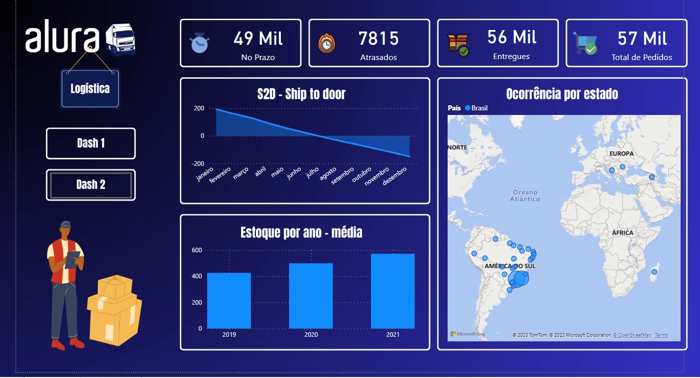
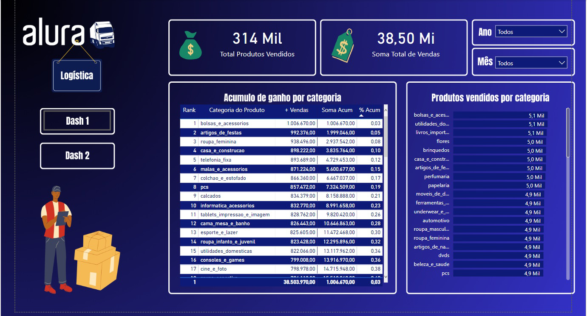

# Introdução
Este arquivo Power BI foi criado para o desafio de Business Intelligence proposto pela plataforma Alura. O desafio consistia em criar um dashboard que permitisse a análise de dados de logística de uma empresa fictícia.

  

# Funcionalidades
O dashboard contém diversas funcionalidades que permitem a visualização e análise dos dados de logística da empresa. Algumas das principais funcionalidades são:

- Análise de custos por transporte
- Monitoramento de entregas por região
- Análise de prazo de entrega por região
- Análise de volume de entregas por região

# Como utilizar
Para utilizar o arquivo Power BI Alura_log.pbix, é necessário ter o software Power BI Desktop instalado em sua máquina. Após o download do arquivo, abra o Power BI Desktop e abra o arquivo através da opção "Abrir arquivo".

Uma vez aberto o arquivo, é possível utilizar todas as funcionalidades do dashboard através dos filtros e gráficos interativos presentes nas diferentes páginas.

# Fonte dos dados
Os dados utilizados neste dashboard são fictícios e foram fornecidos pela Alura como parte do desafio de Business Intelligence.

# Licença
Este arquivo Power BI é de autoria da Alura e pode ser utilizado livremente para fins educacionais e não-comerciais. Para qualquer outro uso, é necessário entrar em contato com a Alura para obter autorização prévia.
